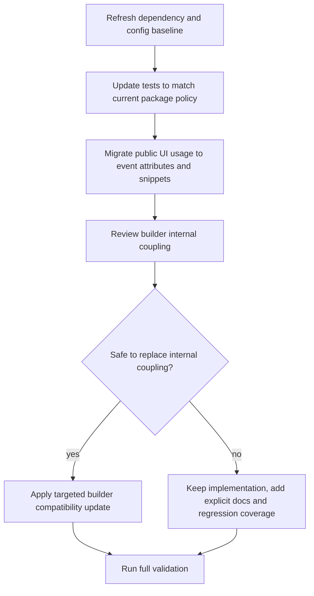

# Latest Dependency And Svelte 5 Usage Design

## Background

The `svelte-lib` repository is already maintained with a "track latest" package policy in both the root package and the `builder/` subpackage. In practice, the repository is only partially aligned with that policy:

- package manifests declare `latest`, but lockfiles are not fully refreshed
- some tests still assert old pinned versions and outdated peer ranges
- public Svelte component usage still includes legacy `slot` and `on:` patterns
- `builder` still relies on Svelte internal and source-layout-specific paths in a few critical places

This design defines a safe, implementation-ready path to bring the repository up to date without turning the work into a large architectural rewrite.

## Verified Dependency Baseline

Checked on `2026-04-04` against official package metadata and Svelte documentation:

- `svelte@5.55.1`
- `svelte-check@4.4.6`
- `typescript@6.0.2`
- `jsdom@29.0.1`
- `@types/node@25.5.2`
- `@types/bun@1.3.11`
- `esbuild@0.28.0`

Reference sources:

- Svelte v5 migration guide: <https://svelte.dev/docs/svelte/v5-migration-guide>
- npm package metadata:
  - <https://registry.npmjs.org/svelte/latest>
  - <https://registry.npmjs.org/svelte-check/latest>
  - <https://registry.npmjs.org/typescript/latest>
  - <https://registry.npmjs.org/jsdom/latest>
  - <https://registry.npmjs.org/@types/node/latest>
  - <https://registry.npmjs.org/@types/bun/latest>
  - <https://registry.npmjs.org/esbuild/latest>

## Goals

1. Align root and `builder/` dependency state with the current latest releases.
2. Update public-facing Svelte usage patterns in the repository to current Svelte 5 recommendations where the change is low-risk and externally meaningful.
3. Make package metadata, tests, types, and migration docs agree with the actual repository policy.
4. Preserve build, dev, route, and UI behavior through targeted validation.

## Non-Goals

1. Do not perform a broad API redesign or directory reshuffle.
2. Do not rewrite the `builder` HMR/runtime architecture solely to eliminate every internal Svelte dependency in one pass.
3. Do not introduce new frameworks, new package managers, or unrelated abstractions.
4. Do not promise long-term dual support for both legacy slot usage and snippet usage unless implementation proves that compatibility is trivial and valuable.

## Current State Findings

### Root Package

- [`package.json`](/._/svelte-lib/package.json) already declares `latest` for root dev dependencies and peer dependencies.
- [`bun.lock`](/._/svelte-lib/bun.lock) resolves most packages to current releases, but `@types/node` is behind the latest checked metadata.
- [`tsconfig.json`](/._/svelte-lib/tsconfig.json) still uses `"bun-types"` in `compilerOptions.types`, while repository tests already expect the current Bun type entry name `"bun"`.
- [`route/tests/query-navigation-history.test.ts`](/._/svelte-lib/route/tests/query-navigation-history.test.ts) still hardcodes old dependency versions and old peer ranges, conflicting with the repository's current package policy.

### Public Svelte Usage

The following files still expose legacy patterns that should be updated as part of the "latest usage" goal:

- slot API:
  - [`ui/box/Block.svelte`](/._/svelte-lib/ui/box/Block.svelte)
  - [`ui/input/StringInput.svelte`](/._/svelte-lib/ui/input/StringInput.svelte)
  - [`ui/input/RangeInput.svelte`](/._/svelte-lib/ui/input/RangeInput.svelte)
  - [`ui/modal/FilledModal.svelte`](/._/svelte-lib/ui/modal/FilledModal.svelte)
  - [`ui/swiper/Swiper.svelte`](/._/svelte-lib/ui/swiper/Swiper.svelte)
- event directive syntax:
  - [`ui/button/FilledButton.svelte`](/._/svelte-lib/ui/button/FilledButton.svelte)
  - [`ui/button/IconButton.svelte`](/._/svelte-lib/ui/button/IconButton.svelte)
  - [`ui/button/TextButton.svelte`](/._/svelte-lib/ui/button/TextButton.svelte)
  - [`ui/input/StringInput.svelte`](/._/svelte-lib/ui/input/StringInput.svelte)
  - [`ui/input/RangeInput.svelte`](/._/svelte-lib/ui/input/RangeInput.svelte)
  - [`ui/modal/FilledModal.svelte`](/._/svelte-lib/ui/modal/FilledModal.svelte)
  - [`ui/plyr/Plyr.svelte`](/._/svelte-lib/ui/plyr/Plyr.svelte)

### Builder

`builder` is the main compatibility risk area.

Observed internal coupling points:

- [`builder/dev.ts`](/._/svelte-lib/builder/dev.ts) maps dev imports to `svelte/src/*`
- [`builder/tests/svelte-runtime-alias.test.ts`](/._/svelte-lib/builder/tests/svelte-runtime-alias.test.ts) asserts Svelte source-layout-specific files
- [`builder/src/hmr-client.ts`](/._/svelte-lib/builder/src/hmr-client.ts) imports `svelte/internal/client`

This coupling is not automatically wrong, but it means "upgrade to latest" must include explicit review and regression verification for `builder`, not just dependency refresh.

## Chosen Approach

Use a staged upgrade with strict verification gates:

1. unify package/test/type conventions first
2. migrate public Svelte usage next
3. refresh and review `builder` dependencies and internal coupling last
4. run verification after each logical closure, then full validation at the end

This approach is preferred over a lockfile-only update because the repository currently contains contradictory rules:

- manifests say `latest`
- tests still assert pinned historical versions
- docs already describe some migration behavior that code has not fully normalized around

It is also preferred over a full `builder` rewrite because the latter would expand scope into architecture work instead of controlled upgrade work.

## Implementation Scope

### Phase 1: Baseline Alignment

Target outcomes:

- lockfiles refreshed to current latest state
- Bun type entry aligned with current Bun conventions
- metadata tests reflect repository policy instead of stale exact versions

Likely files:

- [`package.json`](/._/svelte-lib/package.json)
- [`bun.lock`](/._/svelte-lib/bun.lock)
- [`builder/package.json`](/._/svelte-lib/builder/package.json)
- [`builder/bun.lock`](/._/svelte-lib/builder/bun.lock)
- [`tsconfig.json`](/._/svelte-lib/tsconfig.json)
- [`route/tests/query-navigation-history.test.ts`](/._/svelte-lib/route/tests/query-navigation-history.test.ts)
- [`tests/bun-latest-api.test.ts`](/._/svelte-lib/tests/bun-latest-api.test.ts)

### Phase 2: Public Svelte 5 Usage Alignment

Target outcomes:

- event handlers use current event attribute style instead of `on:`
- slot-based public component composition is migrated to snippet-based composition where the component API is explicitly public-facing
- migration docs and README examples show the new usage first

Likely files:

- [`ui/box/Block.svelte`](/._/svelte-lib/ui/box/Block.svelte)
- [`ui/input/StringInput.svelte`](/._/svelte-lib/ui/input/StringInput.svelte)
- [`ui/input/RangeInput.svelte`](/._/svelte-lib/ui/input/RangeInput.svelte)
- [`ui/modal/FilledModal.svelte`](/._/svelte-lib/ui/modal/FilledModal.svelte)
- [`ui/swiper/Swiper.svelte`](/._/svelte-lib/ui/swiper/Swiper.svelte)
- [`ui/button/FilledButton.svelte`](/._/svelte-lib/ui/button/FilledButton.svelte)
- [`ui/button/IconButton.svelte`](/._/svelte-lib/ui/button/IconButton.svelte)
- [`ui/button/TextButton.svelte`](/._/svelte-lib/ui/button/TextButton.svelte)
- [`ui/plyr/Plyr.svelte`](/._/svelte-lib/ui/plyr/Plyr.svelte)
- [`README.md`](/._/svelte-lib/README.md)
- [`docs/migrations/2026-04-latest-svelte5-migration.md`](/._/svelte-lib/docs/migrations/2026-04-latest-svelte5-migration.md)

### Phase 3: Builder Latest Review

Target outcomes:

- `builder` dependency resolutions reach the latest checked versions
- any safe move from internal/source-layout-specific paths to more stable paths is applied
- any remaining internal coupling is explicitly documented and regression-tested

Likely files:

- [`builder/build.ts`](/._/svelte-lib/builder/build.ts)
- [`builder/dev.ts`](/._/svelte-lib/builder/dev.ts)
- [`builder/runtime.ts`](/._/svelte-lib/builder/runtime.ts)
- [`builder/src/hmr-client.ts`](/._/svelte-lib/builder/src/hmr-client.ts)
- [`builder/tests/svelte-runtime-alias.test.ts`](/._/svelte-lib/builder/tests/svelte-runtime-alias.test.ts)
- [`builder/README.md`](/._/svelte-lib/builder/README.md)

## Control Flow



## Compatibility Strategy

### Package Policy

The repository should continue to express "follow latest" in manifests, but tests must stop encoding obsolete exact versions as a proxy for correctness. The package-policy tests should instead assert:

- required dependencies exist
- root and `builder` packages follow the intended `latest` policy where applicable
- peer dependency declarations remain intentional and explicit

### Public API Migration

Public examples and public components should lead with current Svelte 5 usage. This includes:

- event attributes replacing `on:...`
- snippet-based child composition replacing named/default slots for the targeted public components

Where the migration is user-visible, docs and migration notes must be updated in the same change set.

### Builder Internal Coupling

`builder` is allowed to retain intentional internal Svelte coupling if all of the following remain true:

1. the coupling is necessary for the current build/dev behavior
2. a safer public alternative is not available without broader redesign
3. tests and docs clearly mark the coupling as an upgrade-sensitive boundary

This keeps the work grounded in delivery reality instead of forcing a speculative rewrite.

## Validation Strategy

Repository-level validation baseline:

```bash
bun test
bun run typecheck
```

Additional builder validation when needed:

```bash
cd builder
bun run build
```

Validation expectations:

- all existing automated tests pass after any updated assertions
- typecheck passes with the current Bun type entry and current TypeScript/Svelte versions
- public Svelte component tests continue to pass after syntax/API migration
- `builder` tests continue to validate runtime alias behavior or are updated to match any safe compatibility changes

## Risks

### Medium Risk

- slot-to-snippet migration could break consumer-facing expectations if implementation forgets to preserve content placement semantics
- event attribute migration may surface typing differences in certain components
- changing metadata tests from exact version assertions to policy assertions may accidentally become too weak if not designed carefully

### High Risk

- `builder` dev/runtime behavior depends on Svelte internals and source layout
- upgrading `builder` dependencies without reviewing those assumptions could break dev serving, HMR, or alias resolution despite unit tests appearing healthy

## Rollback Strategy

Use small, logically isolated commits:

1. baseline config and metadata/test alignment
2. public Svelte usage migration
3. `builder` compatibility updates

If the final phase proves unstable, the earlier phases can still stand on their own and the `builder` changes can be reverted independently.

## Success Criteria

The work is complete when all of the following are true:

1. root and `builder` package states are refreshed to current latest dependency resolutions
2. repository tests and docs no longer encode stale dependency expectations
3. targeted public Svelte components use current recommended patterns
4. `builder` has a documented and validated position on every discovered internal coupling point
5. validation commands succeed in the implementation environment

## Out Of Scope Questions Resolved

No additional product decisions are required before planning. The remaining work is implementation detail and compatibility verification, not scope definition.
